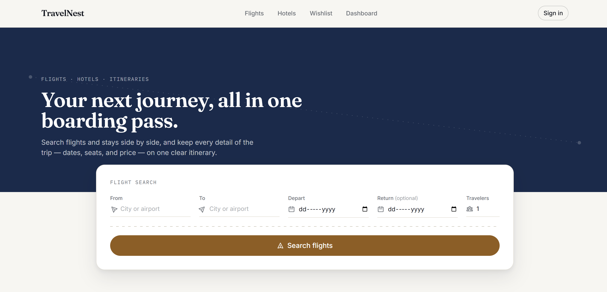
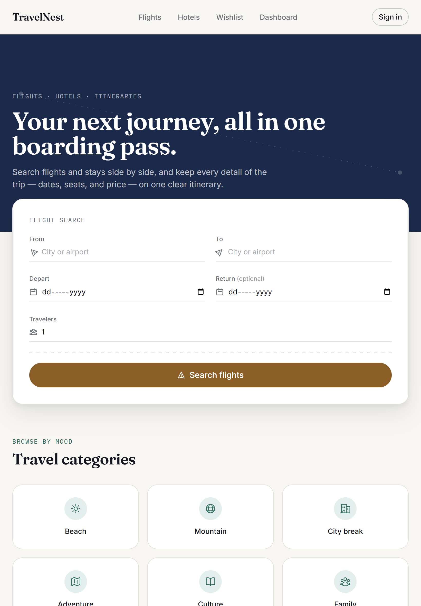
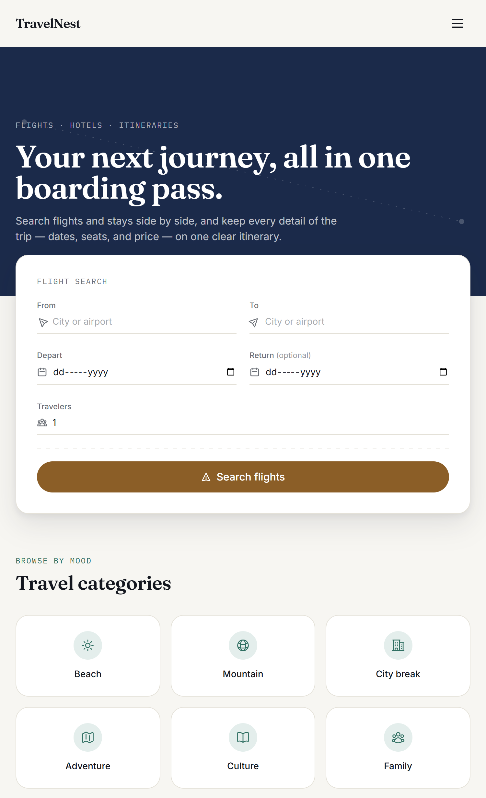

<div align="center">

# ✈️ TravelNest

### A modern frontend travel booking platform built with React.

TravelNest is a **frontend-only** travel booking application designed to showcase modern React development practices, including reusable component architecture, state management, routing, form handling, responsive design, and accessibility.

Built as a portfolio project inspired by real-world travel platforms such as Airbnb, Booking.com, and Google Flights.

<br>

[](https://react.dev/)
[](https://vitejs.dev/)
[](https://tailwindcss.com/)
[](https://redux-toolkit.js.org/)
[](https://reactrouter.com/)
[](./LICENSE)
[](#-features)
[](#-contributing)

**🚀 Live Demo** • **📖 Documentation** • **✨ Features** • **📸 Screenshots** • **⚙️ Installation** • **🏗️ Architecture**

[Live Demo](#-live-demo) · [Features](#-features) · [Screenshots](#-screenshots) · [Getting Started](#-getting-started) · [Architecture](#-project-architecture)

</div>

<br>

## 📖 Overview

**TravelNest** is a modern frontend travel booking platform built with **React**, designed to simulate the experience of searching, exploring, and booking trips through a clean and responsive user interface.

The application includes flight and hotel listings, destination pages, a complete booking workflow, wishlist management, and a personalized dashboard. It is built entirely on the frontend using local mock data, allowing the focus to remain on React architecture, component design, state management, routing, form handling, and responsive UI development.

Inspired by platforms such as **Airbnb**, **Booking.com**, and **Google Flights**, TravelNest follows modern UI/UX principles while maintaining its own visual identity. Instead of replicating an existing product, the project introduces a travel-themed design language featuring boarding-pass inspired cards, structured layouts, and a consistent design system.

This project was created to strengthen practical frontend development skills and demonstrate the ability to build a scalable React application using reusable components, organized project structure, and modern development practices.

---

## 🚀 Project Highlights

- ✨ Modern travel booking interface built with React
- 📱 Fully responsive across desktop, tablet, and mobile
- ⚛️ Built using reusable React components
- 🗂️ Organized project architecture for scalability
- 🔄 Redux Toolkit for global state management
- 📝 React Hook Form for form validation
- 🎯 React Router for client-side navigation
- ❤️ Wishlist with Local Storage persistence
- ⚡ Fast development experience powered by Vite

---

## 🔗 Live Demo

| | |
|---|---|
| 🌐 **Live Website** | [your-deployment-url.vercel.app](https://your-deployment-url.vercel.app) *(placeholder)* |
| 💻 **GitHub Repository** | [github.com/Danishh07/travel-booking-website](https://github.com/Danishh07/travel-booking-website) | 

---

## 📸 Screenshots

### Desktop View


### Tablet View


### Mobile View


<details>
<summary><strong>More screenshots (Booking, Flights, Hotels, Dashboard)</strong></summary>
<br />

| Page | Preview |
|---|---|
| Flights (search, filters, sorting) | `` |
| Hotels (search, filters, sorting) | `` |
| Booking Flow (passenger details + summary) | `` |
| Dashboard (trips, wishlist, account) | `` |

*Replace the paths above with real screenshots in `docs/screenshots/` once available.*

</details>

---

## ✨ Features

### ✈️ Travel Experience

- Flight Search & Booking
- Hotel Search & Booking
- Destination Explorer
- Booking Workflow

### 👤 User Experience

- Wishlist
- Dashboard
- Help Center
- Contact Form

### ⚛️ React Features

- Redux Toolkit
- React Hook Form
- React Router
- Lazy Loading

### 🎨 UI & Performance

- Responsive Design
- Accessible UI
- Reusable Components
- Modern Tailwind Design
---

## 🛠️ Tech Stack

| Technology | Purpose |
|------------|---------|
| **React 18** | Building a modern component-based user interface |
| **Vite** | Fast development server and optimized production builds |
| **Tailwind CSS** | Utility-first CSS framework for responsive UI development |
| **React Router DOM** | Client-side routing and navigation |
| **Redux Toolkit** | Global state management |
| **React Hook Form** | Form handling and validation |
| **React Icons** | Consistent icon library |
| **Axios** | Prepared for future API integration |
| **ESLint** | Code quality and linting |

---

## 📁 Folder Structure

```text
travelnest/
├── public/
├── src/
│   ├── assets/                 # Images, icons, and static assets
│   ├── components/
│   │   ├── common/             # Reusable UI components
│   │   ├── layout/             # Navbar, Footer, Layout
│   │   └── sections/           # Page-specific sections
│   │       ├── home/
│   │       ├── flights/
│   │       ├── hotels/
│   │       ├── destination/
│   │       ├── booking/
│   │       ├── dashboard/
│   │       └── help/
│   ├── pages/                  # Route-level pages
│   ├── routes/                 # Application routing
│   ├── redux/
│   │   ├── store.js
│   │   └── slices/
│   ├── hooks/                  # Custom React hooks
│   ├── services/               # API layer (future integration)
│   ├── utils/                  # Utility functions
│   ├── constants/              # Application constants
│   ├── data/                   # Local mock data
│   ├── App.jsx
│   ├── main.jsx
│   └── index.css
├── tailwind.config.js
├── eslint.config.js
├── package.json
└── README.md
```

---

## 🚀 Getting Started

Follow these steps to run the project locally.

### Prerequisites

Before getting started, make sure you have the following installed:

- Node.js 18 or later
- npm

### Installation

```bash
# Clone the repository
git clone https://github.com/Danishh07/travel-booking-website.git

# Navigate to the project folder
cd travel-booking-website

# Install dependencies
npm install

# Start the development server
npm run dev
```

Once the server starts, open **http://localhost:5173** in your browser.

---

### 📜 Available Scripts

| Command | Description |
|----------|-------------|
| `npm run dev` | Starts the development server |
| `npm run build` | Creates an optimized production build |
| `npm run preview` | Previews the production build locally |
| `npm run lint` | Runs ESLint to check code quality |

---

## 🏗️ Project Architecture

<details>
<summary><strong>Pages (<code>src/pages</code>)</strong></summary>

Route-level pages are responsible only for composing the UI. They fetch data from local modules or Redux, delegate complex logic to custom hooks, and render reusable section components.

Current pages include:

`Home`, `Flights`, `Hotels`, `DestinationDetails`, `Booking`, `Wishlist`, `Dashboard`, `About`, `Careers`, `Press`, `Help`, `Cancellation`, `Contact`, and `NotFound`.

Business logic is intentionally kept outside page components to improve readability and maintainability.

</details>

<details>
<summary><strong>Components (<code>src/components</code>)</strong></summary>

The component architecture is divided into three layers:

- **`common/`** — Reusable UI components shared across the application.
- **`layout/`** — Global layout components such as `Navbar`, `Footer`, and `Layout`.
- **`sections/`** — Feature-specific UI sections grouped by page (Home, Flights, Hotels, Booking, Dashboard, etc.).

This separation keeps components modular, reusable, and easy to maintain.

</details>

<details>
<summary><strong>Redux (<code>src/redux</code>)</strong></summary>

Redux Toolkit is used only for application-wide state such as bookings, wishlist, and shared UI preferences.

Feature-specific state like search filters, forms, and temporary UI interactions remain inside local React state or React Hook Form to keep the global store lightweight and maintainable.

</details>

<details>
<summary><strong>Hooks (<code>src/hooks</code>)</strong></summary>

Custom hooks encapsulate reusable business logic such as search filtering, booking management, wishlist handling, and form configuration.

This keeps page components focused on rendering while improving code reuse across the application.

</details>

<details>
<summary><strong>Services (<code>src/services</code>)</strong></summary>

The `services` directory is reserved for future backend integration.

The current version uses local mock data, making it easy to replace with real REST APIs without changing the UI architecture.

</details>

<details>
<summary><strong>Utils (<code>src/utils</code>)</strong></summary>

Utility functions are organized separately for formatting, pricing calculations, and local storage helpers.

Keeping utility logic outside components improves readability, reusability, and maintainability.

</details>

---

## 🗺️ Future Improvements

The following enhancements are planned for future versions of TravelNest:

### 🔧 Backend & APIs
- [ ] Replace local mock data with a real backend API
- [ ] Integrate live flight and hotel booking APIs
- [ ] Add real-time pricing and availability updates

### 🔐 Authentication & Payments
- [ ] Implement user authentication (Sign Up / Login)
- [ ] Integrate Stripe for secure online payments
- [ ] Enable booking history synchronization across devices

### 🌍 User Experience
- [ ] Add Google Maps or Mapbox integration for destinations
- [ ] Introduce email and push notifications for bookings
- [ ] Improve search with advanced filters and recommendations

### 🛠️ Administration & Quality
- [ ] Build an admin dashboard for managing bookings and listings
- [ ] Add unit and component testing using Vitest and React Testing Library
- [ ] Improve application performance and accessibility based on Lighthouse audits

---

## 🎓 Learning Outcomes

Building **TravelNest** helped strengthen practical frontend development skills and provided hands-on experience with modern React development practices.

Throughout this project, I gained experience in:

- **React Router** — Building multi-page applications with nested layouts, dynamic routes, and client-side navigation.
- **Redux Toolkit** — Managing global application state while keeping feature-specific state local.
- **React Hook Form** — Creating scalable forms with validation and dynamic fields.
- **Reusable Component Architecture** — Designing modular components that can be shared across multiple pages.
- **Responsive Web Design** — Developing mobile-first layouts that work seamlessly across desktop, tablet, and mobile devices.
- **Performance Optimization** — Improving application performance using lazy loading, code splitting, memoization, and optimized rendering.
- **Accessibility** — Applying semantic HTML, keyboard navigation, focus management, and accessible form practices.
- **Project Organization** — Structuring a scalable React application with feature-based folders, custom hooks, and clear separation of concerns.

---

## 💡 Why This Project?

TravelNest was built to go beyond a simple UI clone by focusing on the principles used in real-world frontend development.

The primary goal of this project was to strengthen React fundamentals while applying modern development practices such as component reusability, scalable project structure, state management, responsive design, accessibility, and clean code organization.

Key objectives of this project include:

- **Building reusable components** that can be shared across multiple pages.
- **Organizing the project with a scalable architecture** for easier maintenance and future enhancements.
- **Applying modern React practices** using React Router, Redux Toolkit, and React Hook Form.
- **Creating a responsive user experience** across desktop, tablet, and mobile devices.
- **Following accessibility best practices** through semantic HTML, keyboard-friendly interactions, and clear focus states.
- **Keeping the application ready for future backend integration** by separating UI, business logic, and data layers.

TravelNest represents my approach to building maintainable, user-friendly React applications while continuously improving frontend development skills through practical projects.

---

## 📄 License

This project is licensed under the **MIT License**.
See [`LICENSE`](./LICENSE) for details.

---

## 🤝 Contributing

Contributions, issues, and feature requests are welcome.

1. Fork the project
2. Create your feature branch (`git checkout -b feature/amazing-feature`)
3. Commit your changes (`git commit -m 'feat: add amazing feature'`)
4. Push to the branch (`git push origin feature/amazing-feature`)
5. Open a Pull Request

Please keep commits scoped and messages descriptive (this project follows
[Conventional Commits](https://www.conventionalcommits.org/), e.g. `feat:`, `fix:`, `refactor:`).

---

## 🙏 Acknowledgements

TravelNest draws inspiration from the user experience and booking workflows of platforms such as **[Airbnb](https://www.airbnb.com/)**, **[Booking.com](https://www.booking.com/)**, and **[Google Flights](https://www.google.com/travel/flights)**.

This is an independent portfolio project created for learning and demonstration purposes. It is **not affiliated with, endorsed by, or associated with** any of the companies or services mentioned above.

---

<div align="center">

### ⭐ Thanks for Visiting!

If you found this project helpful or interesting, consider giving it a ⭐ on GitHub.

Your support is greatly appreciated!

**Happy Coding! 🚀**

</div>